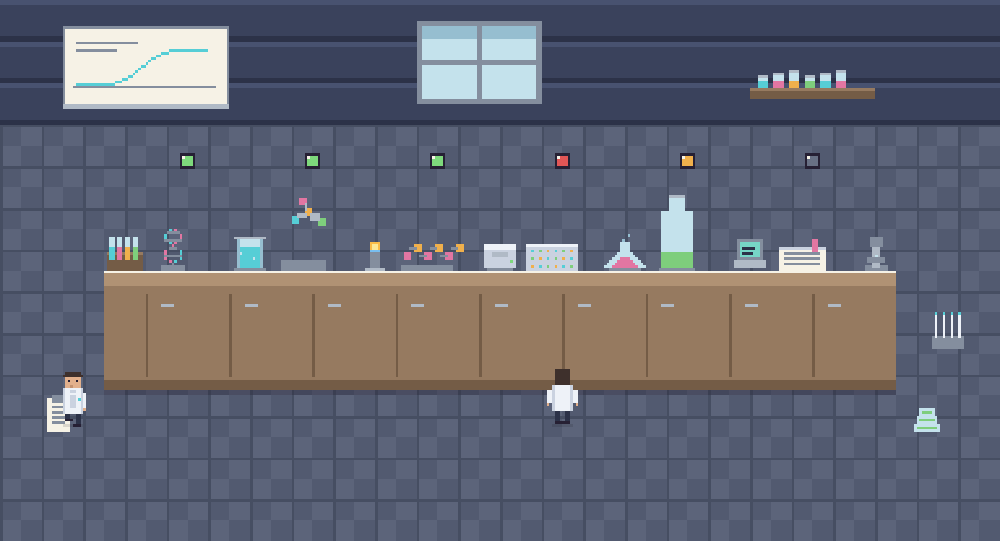

# FalsifyLab

A virtual laboratory where an AI scientist works through a curriculum of
experiments testing one biological hypothesis. For each experiment it gets **one
attempt**: it writes its prediction and a numeric confidence *before* any data
tool unlocks, runs real analysis in an isolated sandbox, is scored by a
deterministic scorer it cannot reach, and is then taught the correct approach
from the literature. Lessons carry forward, because later experiments are built
to need earlier ones.

Everything lands in a lab notebook, including a section called *"what I got
wrong, and why I was confident anyway"*.



## The hypothesis

**H1: GLP-1R is a genetically supported, druggable obesity target, and oral
non-peptide agonism is feasible.**

| # | Experiment | Agent task | Scored on | Needs lessons from |
|---|---|---|---|---|
| 1 | Genetic support | Rank 174 genes at BMI/T2D loci as drug targets | Precision against approved-drug targets, lifted over the base rate | - |
| 2 | Peptide-receptor structure | Find semaglutide's contact residues in PDB 7KI0 | F1 against contacts recomputed at 4.0 A | - |
| 3 | Peptide engineering | Rank nine analogues by duration, explain why | Duration-class ordering + mechanism rubric | 2 |
| 4 | Potency | Fit dose-response curves, rank by consensus EC50 | Fit error in log units + rank correlation | 3 |
| 5 | Small-molecule feasibility | Choose an assay model, predict whether a non-peptide agonist works | Rubric, with a penalty for the rodent trap | 2, 4 |
| 6 | Capstone | An evidence-weighted verdict on H1 | Rubric against the ATTAIN-1 phase 3 result | 1-5 |

The curriculum is a config folder, not code, so the engine is
hypothesis-agnostic: add `curricula/<id>/` and the lab runs it.

## Quick start

```bash
python3 -m venv .venv && ./.venv/bin/pip install -r requirements.txt
./.venv/bin/python -m curricula.glp1r.fetch      # build datasets from primary sources
./.venv/bin/python -m engine.cli validate        # check specs, data, scorers, lessons
./.venv/bin/python -m pytest -q                  # 42 tests

export ANTHROPIC_API_KEY=...
./.venv/bin/python -m engine.cli run --run-id my_run
```

Then the lab itself:

```bash
./.venv/bin/python art/generate.py               # regenerate the spritesheets
cd web && npm install && npm run build && cd ..
./.venv/bin/python -m uvicorn api.main:app --port 8000
# open http://127.0.0.1:8000
```

Click **Start Experiment 1** and the scientist walks to the first station.
Finished stations are clickable and open their notebook page. **Run all** chains
the whole curriculum; the **Calibration** tab charts stated confidence against
score.

## How it works

```
 React UI (room, bench, stations, scientist, notebook)
        |  click Play             ^  events (SSE when live)
        v                         |
 FastAPI backend -------------- event log (JSONL + SQLite)
        |
        +--> agent loop (Anthropic tool use)
        |         |
        |         v
        |    Sandbox A: agent workspace, no network, datasets read-only
        |
        +--> Sandbox B: scorer + ground truth. The agent never gets a handle on it
        |
        +--> lesson cards, appended to what later experiments can read
```

**The gate.** Until the notebook holds `hypothesis_and_prediction` (with a
numeric confidence) and `plan`, every other tool returns `LOCKED`. The prediction
is on the record before the agent can see whether it holds.

**Scoring isolation.** The scorer runs in a sandbox created per scoring call,
with the ground truth mounted there and nowhere else. There is a test asserting
that nothing under `private/` is ever reachable from the agent's sandbox.

**Teaching after the fact.** The lesson card is shown only after the score is
fixed, so it can never influence the attempt it grades. The agent then writes
what it got wrong, and that lesson becomes available to later experiments.

**The event log is the single source of truth.** The notebook and the animation
are both views over it. Replay is the demo default; live mode streams over SSE.

## Running on Modal

```bash
modal setup
modal run api/modal_app.py::build_datasets    # datasets into a volume
modal deploy api/modal_app.py
modal run api/modal_app.py::control_experiment  # both arms in parallel
```

Sandboxes are created with `block_network=True`, so on Modal the isolation is
enforced by the platform rather than approximated in-process. The agent image and
the sandbox image are deliberately different: the sandbox that runs untrusted
code carries neither the API layer nor the Anthropic SDK.

**Status:** the Modal path is written against the documented API but has not been
executed - the development machine had no Modal credentials. The local backend is
the tested one, and both Modal modules say so at the top of the file.

## The control run

The claim that lessons help is testable, so it is tested:

```bash
./.venv/bin/python -m engine.cli run --run-id control_no_lessons --no-lessons
./.venv/bin/python -m engine.cli compare runs/run_001 runs/control_no_lessons
```

This splits the delta by whether an experiment declares `requires_lessons`, and
says plainly when the difference is within noise. With one run per arm, it
usually is.

## Repository layout

```
engine/       event log, specs, agent loop, tool gating, scoring, notebook, CLI
sandbox/      Executor contract; local and Modal backends
curricula/    one folder per hypothesis: specs, scorers, ground truth, lessons, fetch
api/          FastAPI (replay + SSE) and the Modal deployment
web/          Vite + React pixel lab and notebook overlay
art/          generates every spritesheet with Pillow
devin/        curriculum-engineering playbook and session launcher
docs/         reference verification, dataset provenance, credits
```

## What we found

Running the curriculum against Claude Sonnet 5 (Opus 5 for the capstone):

- It scored well - mean **0.90** across six experiments - and it was
  **systematically underconfident**, with a mean calibration gap of **-0.30**.
  The project's premise was that agents are overconfident; this one consistently
  claimed less certainty than its results earned. The notebook measures the gap
  in whichever direction it falls, and the teaching phase produced genuinely
  specific self-criticism about *why* the confidence was miscalibrated.
- On the first run of experiment 2 the agent spent its entire 25-call budget
  parsing the mmCIF and never submitted, scoring zero. That is an artefact of the
  harness, not a finding about the science, so budgets now reserve their last two
  calls for submission and every tool result reports the remaining budget.

Both results are in `runs/`, and the notebook is readable as markdown at
`runs/<id>/notebook.md`.

## Caveats

- **Pretraining leakage is real.** These are famous results. Scoring targets
  data-analysis outputs rather than recall wherever possible, the notebook
  records prior knowledge claimed, and the control run exists to quantify it -
  but a model that already knows about Trp33 cannot unknow it.
- **n=1 per arm.** Treat deltas under about 0.1 between runs as noise.
- **Three data soft spots** - transcribed half-lives, Open Targets release
  dependence, and simulated dose-response points over real potencies - are listed
  in `docs/references.md`.
- Two references in the original project plan were wrong and are corrected there.

## Licence and credits

Art is generated from code; no third-party asset packs are used. Data sources and
their terms are in `docs/CREDITS.md`.
